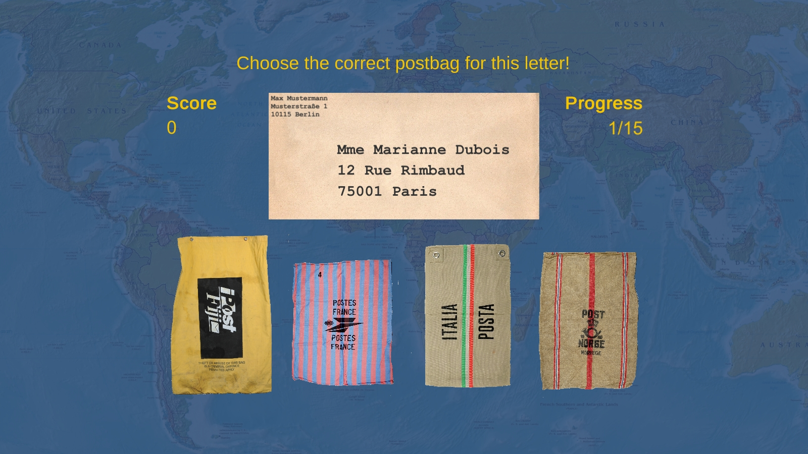

## Global Postmaster

This is an entry in the [Coding Da Vinci Süd 2019 Hackathon](https://codingdavinci.de/events/sued/).

It uses the data provided by the [Museumsstiftung Post und Telekommunikation (Museum Foundation Post and Telecommunication)](http://www.museumsstiftung.de).

### German description:

Global Postmaster ist ein Spiel, das geographisches Wissen vermitteln möchte.

Es nutzt dazu die Bilder der internationalen Postbeutel aus dem Bestand der Museumsstiftung Post und Telekommunikation. 

Der Spieler muss Briefe in den richtigen Postbeutel sortieren. Der Brief trägt nur einen Städtenamen, die Länderangabe wurde leider vom Absender vergessen. Nun ist es am Spieler, die Stadt dem richtigen Land zuzuordnen.

In einem weiteren Modus muss das Land auf der Weltkarte gefunden werden. 

Im Galerie-Modus kann der Spieler alle Postbeutel durchblättern und Informationen über die Länder ansehen. 

Screenshot of preliminary version:

